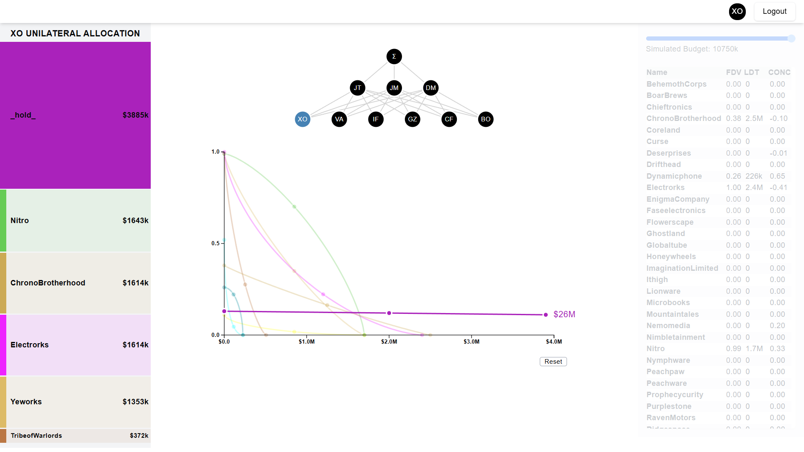
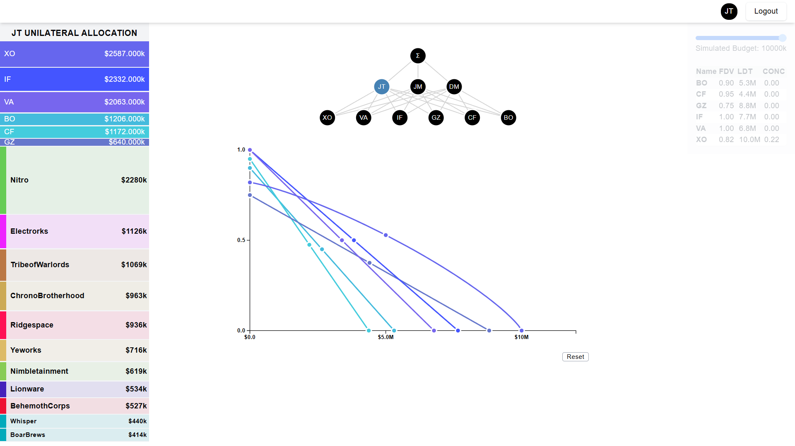
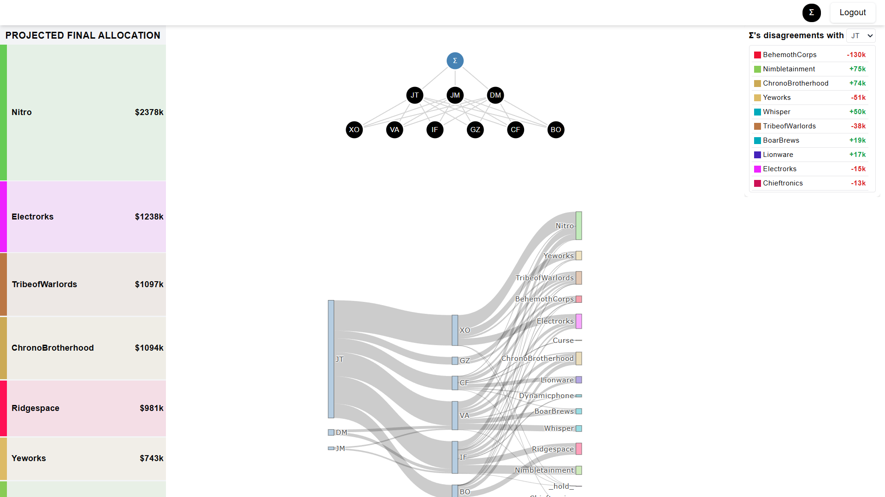
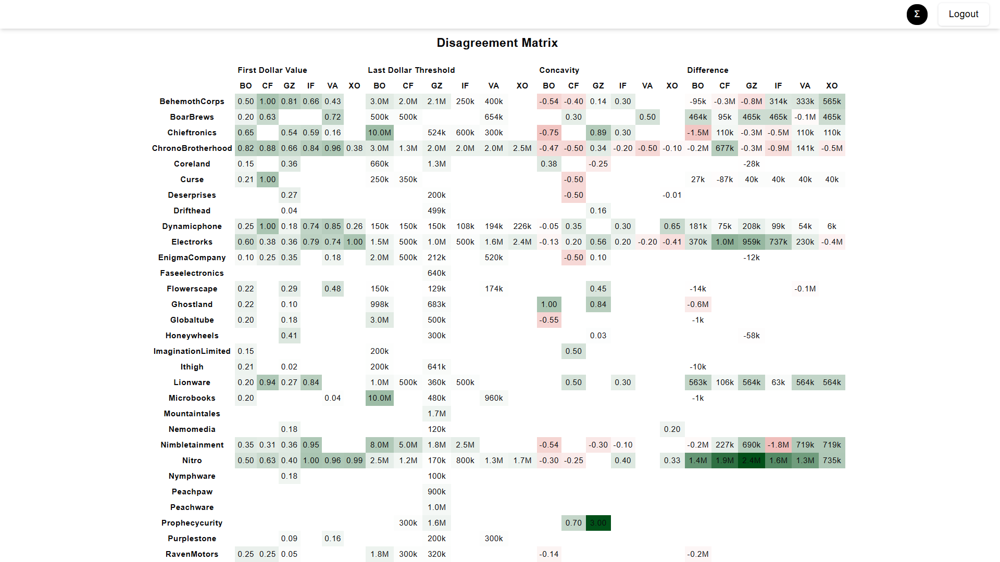

# Grant Recommendation Platform using the S-Process

This project is a full-stack web-based application that replicates the S-Process used by [Survival and Flourishing Fund (SFF)](https://survivalandflourishing.fund/s-process) for grant recommendation. The S-Process is a simulation process that enables philanthropists to delegate grant-making discussions and deliberations to trusted advisors, facilitating collaborative decision-making in funding allocations.

## Preview

### Recommender View


### Funder View


### Sigma View


### Disagreement Matrix



## Technologies Used

The application is built with the following technologies:

### Frontend
- **React** with **Vite** for fast development and bundling.
- **TypeScript** for type safety.
- **Shadcn UI** for elegant, reusable UI components.
- **TailwindCSS** for styling.
- **D3** and **Plotly** for interactive charts
- **React Redux** for state management.


### Backend
- **Flask** as the backend server.
- **MongoDB** for data storage.
- **Flask-PyMongo** as the driver for MongoDB.
- **Gunicorn** as the WSGI server.
- **Flask-JWT-Extended** for JSON Web Token (JWT) authentication.
- **Flask-CORS** for cross-origin resource sharing.

## Installation Instructions

Follow these steps to set up the project on your local machine:

### Prerequisites

- Node.js (version 20 or higher)
- Python (version 3.10 or higher)
- MongoDB (as the database)

### Backend Setup

1. **Clone the Repository**: Clone the project repository to your local machine.

   ```bash
   git clone https://github.com/pavan-k-teja/s_process_funding.git
   cd s_process_funding/backend
   ```

2. **Create a Virtual Environment**: Set up a virtual environment to manage dependencies.

   ```bash
   python3 -m venv venv
   source venv/bin/activate  # On Windows, use `venv\Scripts\activate`
   ```

3. **Install Dependencies**: Install the required Python packages.

   ```bash
   pip install -r requirements.txt
   ```

4. **Set Up Environment Variables**: Create a `.env` file in the `backend` directory with the necessary environment variables. Use the `.env.example` for reference.

    ```env
    MONGO_URI=<your_mongo_uri_here>
    JWT_SECRET_KEY=<your_jwt_secret_here>
    FLASK_ENV=development
    FLASK_DEBUG=True
   ```

5. **Populate Database**: Once your application is connected to MongoDB via the `MONGO_URI`, you can populate the collections and documents. Run the following command from the `backend` directory with the updated URI in the code:

   ```bash
   python data/initiate.py
   ```

6. **Run the Backend Server**: Start the Flask application using Gunicorn.

   ```bash
   gunicorn -w 4 "main:create_app()"
   ```

   This command starts the server with 4 worker processes.

### Frontend Setup

1. **Navigate to the Frontend Directory**: Move to the frontend part of the project.

   ```bash
   cd ../frontend
   ```

2. **Install Dependencies**: Use npm to install the required packages.

   ```bash
   npm install
   ```

3. **Configure Environment Variables**: Create a `.env` file in the `frontend` directory with the necessary environment variables. Use `.env.example` as reference.

   ```env
   VITE_API_URL=<your_api_url>
   ```

   Ensure that the `VITE_API_URL` matches the address where your backend is running.

4. **Run the Frontend Development Server**: Start the Vite development server.

   ```bash
   npm run dev
   ```

   This command will start the frontend server and provide a local URL to view the application.

### Accessing the Application

Once both the backend and frontend servers are running, open your web browser and navigate to the URL provided by the Vite development server (typically `http://localhost:5173`) to access the application.
